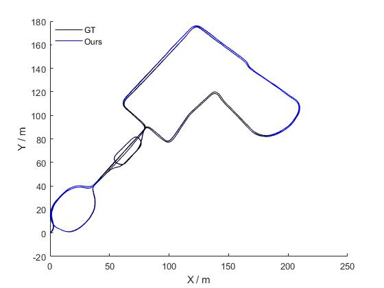

# TCK-VILO
A Tightly-Coupled and Keyframe-Based Visual-Inertial-Lidar Odometry System for Mobile Robots With Adaptive Sensor Reliability Evaluation. And we will open the source code ASAP.

## 1. Experiments on Newer College Dataset
The results are Seq. 1 and Seq. 7, respectivey.

## 2. Experiments on Self-collected Dataset
### 2.1 Our mobile robot platform and hand-held device.

 

### 2.2 Experiment results.

Sequence collected by our mobile robot.

Sequence collected by our hand-henld device.

