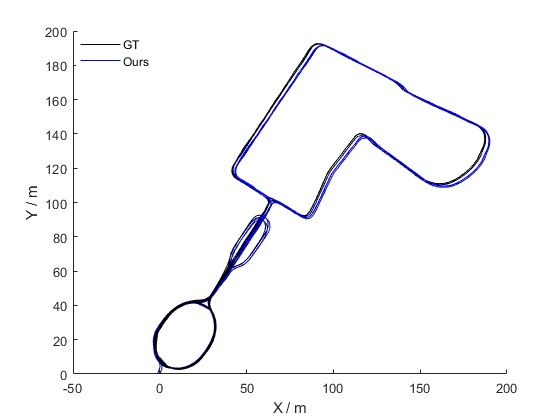
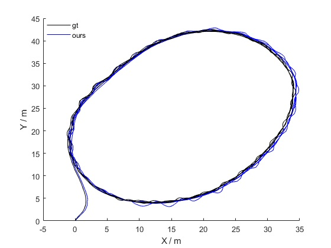
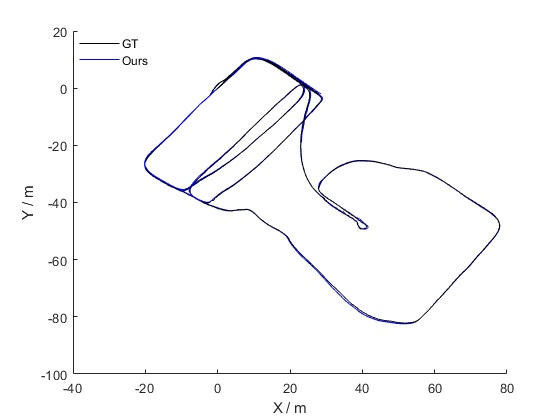

# TCK-VILO
A Tightly-Coupled and Keyframe-Based Visual-Inertial-Lidar Odometry System for Mobile Robots With Adaptive Sensor Reliability Evaluation. And we will open the source code ASAP.

## 1. Experiments on Newer College Dataset
  

## 2. Experiments on Self-collected Dataset
